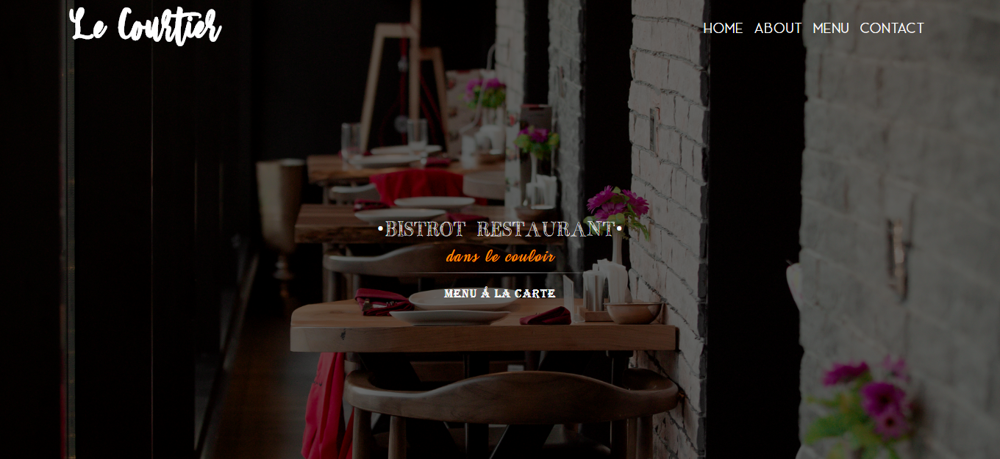

# ✨ Le Courtier JavaScript Restaurant Page 

## 📝 Table of Contents

* [About the Project](#about-the-project)
  * [Built With](#built-with)
* [Contact](#contact)
* [Acknowledgements](#acknowledgements)

<!-- ABOUT THE PROJECT -->
## 👉 About The Project

I designed and built an entire JavaScript page, using webpacker, for a hypethetical bistrot type restaurant. In the page you can go around and click on the nav bar menu in order to see the:
*   Homepage content
*   About
*   Menu á la carte
*   Contact

sections that are displayed inside it's own container.

Link for project specifications: [Odin-Project](https://www.theodinproject.com/courses/javascript/lessons/todo-list)

### 🛠 Built With

*   SCSS - Style
*   Bootstrap4 - Positioning
*   JavaScript - Behaviour and Structure

<!-- CONTACT & SUPPORT -->
## Contact & Support

🙍 Guadalupe Rangel - kanemekanik@gmail.com - ☄

You liked it? ⭐️ Star my project!!!

<!-- ACKNOWLEDGEMENTS -->
## Acknowledgements

* [Microverse](https://www.microverse.org/)
